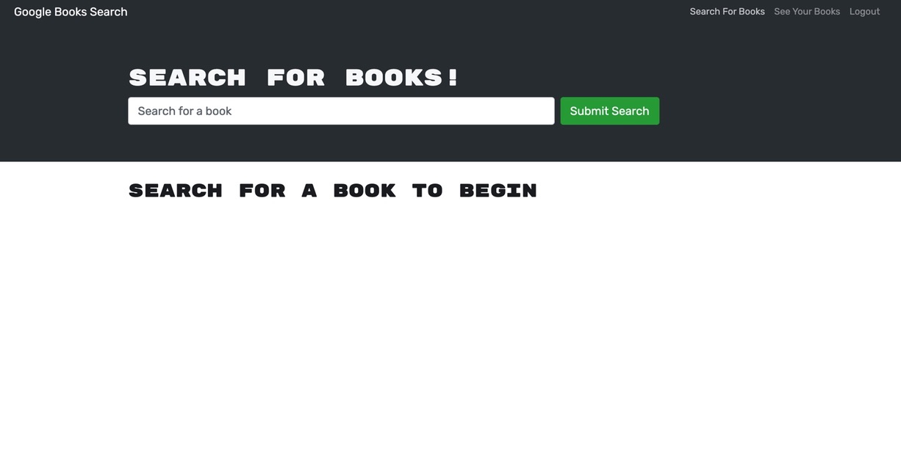
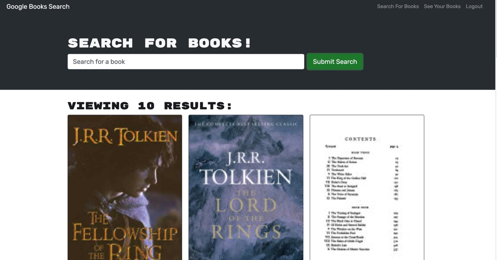
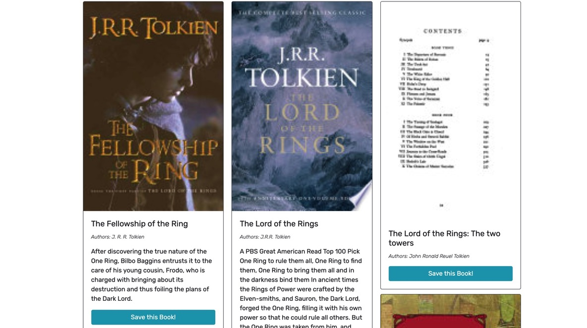
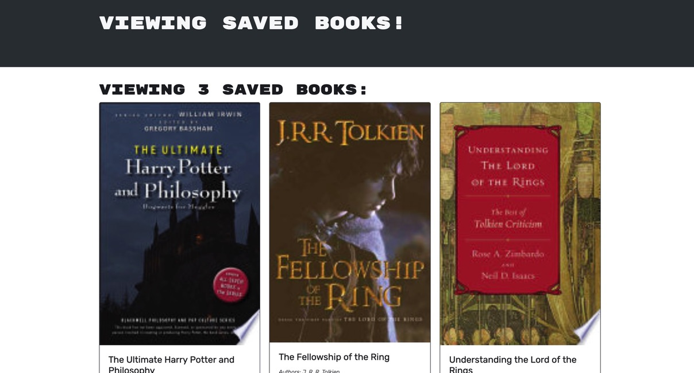

# MERN-Book-Search-Engine

## Description

The goal of this project was to take a functioning Google Books API search engine built with a RESTful API and refactor it to be a GraphQL API built with Apollo Server. This application was built using the MERN stack.

## License:  

## Table of Contents
1. [Description](#description)
2. [Installation](#installation)
3. [Usage](#usage)
4. [Credits](#credits)
5. [Contributing](#contributing)
6. [License](#license)
7. [Questions](#questions)

## Installation

In order for this application to work you will need the node environment installed on your computer. Adequate instructions for downloading the node environment can be found at nodejs.org. Run npm install to install all dependencies for the apllication. Then you can run npm run develop, which will open the application with the nodemon server, which allows you to make updates without restarting the server.

## Usage
1. Make sure all dependencies are installed by running npm install.
2. Then run "npm run develop", which will run the build and start the server.
3. The application should be straightforward to use. There is a login/signup, search for books, and see your books tab in the navbar. There is a specific search bar middle top of the screen, and after you submit your search, the books appear on the page below the search bar. The user can then save a book, navigate to see their saved books, and delete a saved book.

Deployed Site: https://gentle-stream-74371.herokuapp.com/

### Images
  
  
  
  

## Credits

- MDN Web Docs
- npmjs.com
- mongoose.com
- GraphQL
- MongoDB
- VSCode
- StackOverflow

## Contributing

  
For contributing guidelines see link : https://www.contributor-covenant.org/

## License 
This Project is licensed under the MIT license.

* https://opensource.org/licenses/MIT

## Questions

Follow link for github: [Github Profile] (https://github.com/gallaghj13)  
For any additional questions you can reach me at: gallagherj0913@gmail.com